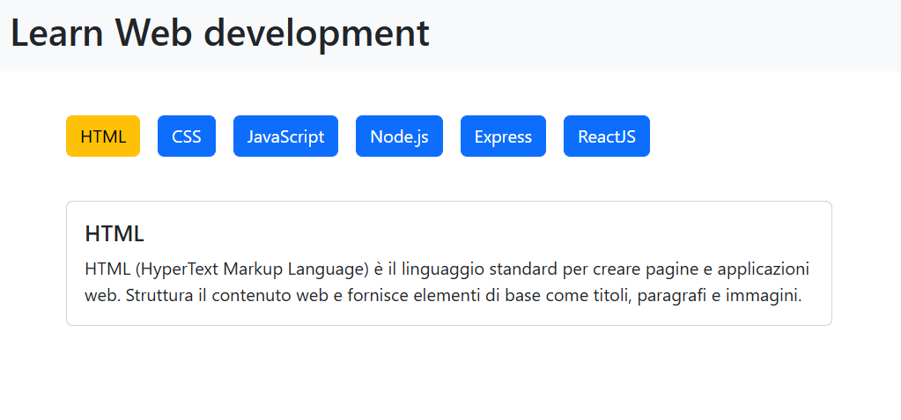

# React Use State

This is the 24th exercise I have completed as part of the web development master. It focuses on React state management via the `useState` hook, dynamic event handling, component decomposition, and unidirectional prop drilling.

Repository name: `react-use-state`

## 📝 Task

The objective of this assignment is to understand and implement dynamic reactive states in a React application using a dataset containing web languages and their descriptions.

The application must fulfill the following core requirements:
* Render a series of cards containing a button named after each language entry.
* Implement state tracking so that clicking a button updates its color and toggles the visibility of the corresponding language description inside that card.

### 🌟 Bonus
* **Single Detail Layout:** Restructure the UI to show a top row list of buttons (one per language) and a single dynamic card below them.
* **Initial State:** On application mount, this single card must default to displaying the title and description of the first language in the data array.
* **State Updates:** Ensure that clicking any individual language button dynamically updates the single card below to show that language's matching details.

### 🚀 Super Bonus
* **Component Abstraction:** Deconstruct the detail card node into an isolated, reusable sub-component while fully maintaining its dynamic rendering properties.
* **Interactive Button Abstraction:** Extract the interactive button items into their own individual sub-components while keeping event triggers and functionalities intact.

## 📷 Reference Webpage



## 📂 Project Structure

```text
react-use-state/
├── node_modules/
├── public/
├── src/
│   ├── assets/
│   │   ├── languages.js
│   │   └── screenshot.png
│   ├── components/
│   │   ├── Button.css
│   │   ├── Button.jsx
│   │   ├── DescriptionCard.css
│   │   └── DescriptionCard.jsx
│   ├── App.css
│   ├── App.jsx
│   ├── index.css
│   └── main.jsx
├── .gitignore
├── .oxlintrc.json
├── index.html
├── package-lock.json
├── package.json
├── README.md
└── vite.config.js
```

## 🛠️ Technologies Used
* HTML5: Semantic structure.
* CSS3: Custom styling and layout.
* JavaScript (ES6): Logic, data processing, and DOM manipulation.
* React: Frontend library framework.
* Vite: Build tool and development server.
* VSCode: IDE.